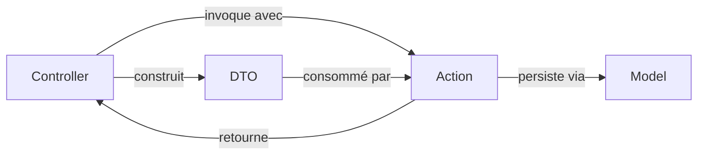

# Architecture Spine — EkoDoc

## Design Paradigm

**Thin Controller → Action → DTO → Eloquent Model.** Convention transverse à tous les projets solo de l'utilisateur, pas une spécificité d'EkoDoc.

- **Controller** : ne contient aucune logique métier. Valide la requête (Form Request), construit un DTO, appelle une Action, retourne une réponse Inertia.
- **Action** : classe PHP pure, invokable (`__invoke`), une seule responsabilité (`CreateDocumentAction`, `ImportDocumentAction`, `DeleteDocumentAction`, `ExportDocumentToPdfAction`...). Zéro dépendance à un package d'action (pas de `lorisleiva/laravel-actions`).
- **DTO** : classe `readonly` PHP native (8.2+), transporte les données entre Controller → Action → persistance. Zéro dépendance (pas de `spatie/laravel-data`).
- **Model** : Eloquent classique, pas de repository intermédiaire — inutile à cette échelle.



Namespaces : `app/Http/Controllers/`, `app/Actions/{Domain}/`, `app/DataTransferObjects/`, `app/Models/`.

## Invariants & Rules

Chaque AD suit le même schéma : **Binds** (FR/NFR ou périmètre couvert), **Prevents** (la divergence précise que cette règle interdit), **Rule** (le comportement contraignant pour tout builder).

### AD-1 — Controllers sans logique métier `[ADOPTED]`

- **Binds:** all
- **Prevents:** un futur builder qui glisse une règle métier dans un controller pendant qu'un autre l'écrit dans une Action, créant deux emplacements de vérité.
- **Rule:** un controller ne fait que valider (Form Request), construire un DTO, appeler exactement une Action, et transformer son retour en réponse. Aucune condition métier (if sur un statut, un type, une règle de calcul) ne vit dans un controller.

### AD-2 — Une Action = une opération métier nommée `[ADOPTED]`

- **Binds:** all
- **Prevents:** deux Actions qui se recouvrent partiellement (ex. une `SaveDocumentAction` générique ET une `CreateDocumentAction` séparée) ou une Action qui fait plusieurs choses non liées.
- **Rule:** chaque Action porte un nom `{Verbe}{Entité}Action` (ex. `ImportDocumentAction`, `CreateTagAction`, `ExportDocumentToWordAction`), a une seule méthode publique `__invoke(DTO $data): mixed`, et ne connaît pas Inertia/HTTP (testable sans requête).

### AD-3 — DTO en frontière de chaque Action `[ADOPTED]`

- **Binds:** all
- **Prevents:** une Action qui accepte un tableau associatif ou un `Request` Laravel directement, rendant son contrat implicite et son test dépendant du framework HTTP.
- **Rule:** toute Action reçoit un DTO `readonly` typé en entrée (jamais un array ou un `Request`). Le DTO est construit dans le Controller (ou un Job/Command si un contexte non-HTTP apparaît plus tard).

### AD-4 — Bibliothèque unifiée : une seule table `documents` `[ADOPTED]`

- **Binds:** FR1, FR2, FR3, FR6, FR7, FR8, FR9, FR10
- **Prevents:** deux modèles de contenu séparés (un pour les fichiers importés, un pour les documents créés) qui divergent sur la recherche, le filtrage ou l'affichage — exactement le piège que le brief reproche aux wikis/GED existants (voir addendum § Tour d'horizon).
- **Rule:** un seul modèle `Document` avec une colonne `source` (`imported` | `created`). Les colonnes propres à un seul côté (`file_path`, `mime_type` pour `imported` ; `content_html` pour `created`) restent nullable plutôt que de justifier deux tables.

### AD-5 — Classement à plat, tags illimités par document `[AMENDED 2026-09-09]`

- **Binds:** FR2, FR10 (modèle de tags — le filtrage par tag, FR7, est gouverné par AD-8)
- **Prevents:** une UI qui suppose une hiérarchie de tags pendant qu'un autre module suppose un tag plat ; un mélange tag/texte libre non contrôlé (doublons du type "Finance"/"finance"/"Finances") ; deux Actions qui écrivent le pivot `document_tag` selon des sémantiques différentes (une en remplacement complet, une en ajout/retrait incrémental), provoquant une perte de mise à jour concurrente sur le même document.
- **Rule:** table `tags` (id, name) à plat, sans hiérarchie, sans parent. Relation many-to-many via pivot `document_tag` (document_id, tag_id). Pas de limite de nombre de tags par document. Tags gérés exclusivement depuis la page Configuration (FR14, voir AD-18) — jamais de création à la volée ailleurs (pas de texte libre dans le sélecteur de tags). `SyncDocumentTagsAction` est l'unique Action qui écrit `document_tag`, invoquée en remplacement complet (`sync()`, jamais `attach()`/`detach()` incrémental) depuis les deux contextes UI qui assignent des tags à un document (sauvegarde Éditeur, Fiche document) ; aucune autre Action n'écrit ce pivot directement. `TagSelector.vue` est un composant unique et partagé (jamais réimplémenté par écran) : multi-select construit en Tailwind CSS pur, sans librairie de composants tierce (ex. pas de `vue-multiselect` — même contrainte que le reste de l'UI, héritée d'`EXPERIENCE.md`), et n'expose aucun mode "créable" — il ne propose que des tags déjà existants (chargés depuis la table `tags`), jamais de saisie libre, dans quelque écran que ce soit où il est utilisé.
- **Changelog:** remplace l'AD-5 v1 (catégorie unique, table `categories` à plat, `documents.category_id` nullable) et retire AD-16 (`category_id` : un seul point d'écriture — obsolète, le champ disparaît). Table `categories`, colonne `documents.category_id`, `CategorizeDocumentAction`, modèle/controller `Category` sont **supprimés**, pas dépréciés. Aucune migration des données existantes vers des tags équivalents (décision produit explicite, 2026-09-09) — le tagging repart de zéro.

### AD-6 — Stockage à l'import synchrone, extraction de texte en file d'attente `[AMENDED 2026-09-01]`

- **Binds:** FR1, FR6
- **Prevents:** un import qui bloque la requête HTTP (et le proxy nginx local) le temps d'extraire le texte d'un document réel volumineux (constaté : PDF de 135 pages dépassant toute limite de timeout raisonnable) ; et, à l'inverse, un import qui suppose un traitement en arrière-plan pendant qu'une autre partie du code suppose le document immédiatement complet et cherchable juste après l'import — d'où le statut `extraction_status` explicite plutôt qu'une simple présence/absence de `extracted_text`.
- **Rule:** `ImportDocumentAction` exécute, dans la même requête HTTP et dans une transaction dédiée : stockage du fichier → création du `Document` (`extraction_status = pending`). L'extraction de texte est ensuite dispatchée comme job en file d'attente (`ExtractDocumentTextJob`, driver `database`, déjà configuré par le squelette Laravel) et s'exécute hors requête HTTP — un worker (`php artisan queue:work`/`queue:listen`) doit tourner pour la traiter. La requête d'import retourne immédiatement après le stockage, sans attendre l'extraction. `extraction_status` transite `pending` → `processing` → `completed`/`failed` ; le document reste consultable/téléchargeable et visible dans la Bibliothèque quel que soit son statut d'extraction. L'indexation Scout n'est jamais un appel manuel : le trait `Searchable` la déclenche automatiquement via l'événement `saved` du Model. **Décision initiale (AD-6 v1, "aucun job en file d'attente") révisée le 2026-09-01** après un cas réel bloquant (voir memlog/change log de la Story 1.1) : le gain de robustesse pour des documents volumineux/complexes l'emporte sur la simplicité opérationnelle d'un traitement 100% synchrone, au prix d'une dépendance à un worker actif.

### AD-7 — Fichiers originaux sur disque privé `[ADOPTED]`

- **Binds:** FR1, FR5, NFR1
- **Prevents:** un fichier accessible par URL publique directe pendant qu'un autre point du code suppose un accès contrôlé — divergence qui bloquerait silencieusement l'ouverture multi-utilisateurs post-v1 (PRD § Trajectoire).
- **Rule:** disque Laravel `local` (`storage/app/private/documents/{document_id}/{filename}`), jamais `public`. Le téléchargement (FR5) passe toujours par une route applicative qui streame le fichier (`Storage::download()`), jamais par un lien direct. Cette route (et la route de prévisualisation, AD-10) vérifie systématiquement l'existence/lisibilité du fichier avant de le servir ; son absence déclenche l'état "Fichier source introuvable" (`EXPERIENCE.md` § State Patterns), jamais une exception non gérée.

### AD-8 — Recherche et filtrage unifiés via Scout + driver `database` `[ADOPTED]`

- **Binds:** FR6, FR7, NFR2
- **Prevents:** une recherche qui repose sur des `LIKE '%...%'` ad hoc à un endroit et sur l'index Scout à un autre, avec des résultats incohérents ; et un chemin "recherche avec terme" (`Document::search()`) qui diverge silencieusement du chemin "filtres seuls" (`Document::query()->where()`) sur le tri, la pagination ou les relations chargées, alors que `EXPERIENCE.md` traite recherche et filtres comme un seul flux continu.
- **Rule:** `Document` implémente `Laravel\Scout\Searchable`. `DocumentController@index` construit la liste des résultats via un unique point d'entrée qui applique systématiquement le même tri/pagination/eager-loading, terme de recherche présent ou non — jamais deux chemins de requête codés séparément. Le champ indexé est `extracted_text` (voir AD-9), pas les colonnes de métadonnées.

### AD-9 — Contenu cherchable : best-effort à l'import, dérivé du contenu à la création `[ADOPTED]`

- **Binds:** FR1, FR6, FR10
- **Prevents:** un import de PDF/Word/Excel qui échoue entièrement à cause d'une erreur d'extraction de texte, alors que le fichier lui-même est valide et doit rester consultable/téléchargeable (principe du brief : l'original doit toujours rester accessible) ; et un document créé dans l'éditeur qui rejoint la Bibliothèque sans jamais devenir cherchable, contredisant FR10 ("mêmes propriétés de classement et de recherche qu'un document importé").
- **Rule:** pour `source = imported`, l'extraction de texte (`smalot/pdfparser` pour PDF ; lecture `phpoffice/phpword`/`phpoffice/phpspreadsheet` pour Word/Excel) tourne dans `ExtractDocumentTextJob` (voir AD-6), hors de la transaction d'import. Un échec d'extraction — y compris un PDF scanné sans couche texte (aucun OCR en v1), ou un timeout/erreur fatale sur un document pathologique — logue une alerte, met `extraction_status = failed` et laisse `extracted_text` à `NULL` ; cela n'a jamais pu interrompre l'import lui-même puisque le `Document` et le fichier sont déjà committés avant que le job ne démarre. Le document reste consultable et seulement absent de la recherche. `smalot/pdfparser` est en maintenance limitée (vérifié 2026-08) ; son échec dégrade la recherche, jamais l'import. Pour `source = created`, `extracted_text` est dérivé automatiquement de `content_html` (texte brut, balises retirées) à chaque sauvegarde, de façon synchrone (`extraction_status = completed` immédiatement) — jamais laissé vide ni mis en file d'attente pour un document créé.

### AD-10 — Prévisualisation Office : conversion à la demande, mise en cache `[ADOPTED]`

- **Binds:** FR4
- **Prevents:** une conversion relancée à chaque affichage de la Fiche document (coûteuse) pendant qu'un autre point du code suppose un fichier déjà converti disponible ; et une divergence sur le rendu du PDF natif (un module qui embarque PDF.js pendant qu'un autre suppose le lecteur natif du navigateur).
- **Rule:** `ConvertDocumentToPreviewAction` invoque `soffice --headless --convert-to pdf` (LibreOffice) en ligne de commande via `Illuminate\Process`, uniquement pour `source = imported` et `mime_type` Word/Excel. Le PDF résultant est mis en cache sur `storage/app/private/previews/{document_id}.pdf`, invalidé uniquement par suppression/ré-import du document (v1 n'a pas de fonctionnalité de remplacement de fichier — pas de scénario de "fichier source modifié" à couvrir). PDF natif (`source = imported`, `mime_type` PDF) et documents créés (`source = created`) : jamais de conversion — affichage direct via le lecteur PDF natif du navigateur (`<iframe>`/`<embed>`) ou rendu direct de `content_html`, aucune bibliothèque JS dédiée ; ce choix écarte explicitement PDF.js et résout la piste laissée ouverte par l'addendum du brief.

### AD-11 — Export PDF via rendu HTML réel (Browsershot) `[ADOPTED]`

- **Binds:** FR11, NFR5
- **Prevents:** un export PDF qui recalcule la position des images séparément du rendu écran, réintroduisant le risque de décalage que NFR5 interdit explicitement.
- **Rule:** `ExportDocumentToPdfAction` rend une vue Blade du contenu TipTap (le même HTML que l'éditeur affiche) et la convertit via `spatie/browsershot` (Chromium headless réel). Aucune génération PDF alternative (pas de `dompdf`/`wkhtmltopdf`) pour ce chemin.

### AD-12 — Export Word : best-effort documenté, pas garanti au niveau du PDF `[ADOPTED]`

- **Binds:** FR12, NFR5
- **Prevents:** une attente implicite de parité totale PDF/Word sur la fidélité image, alors que le mapping HTML→OOXML ne le permet pas nativement — évite qu'un builder traite un échec de positionnement Word comme un bug au lieu d'une limite connue.
- **Rule:** `ExportDocumentToWordAction` utilise `phpoffice/phpword` (import HTML). Un échec de positionnement d'image en sortie Word est un **risque assumé**, pas un défaut à corriger en priorité — traitement conforme au cas d'échec déjà écrit dans `EXPERIENCE.md` § Flow 3 (message d'erreur explicite, jamais un fichier dégradé livré sans avertissement). Décision produit explicite (voir `.memlog.md`) : cette AD restreint la garantie "critique, pas secondaire" du NFR5 au format PDF (AD-11) ; le Word reste soumis à NFR5 en intention — jamais un échec silencieux — mais pas en garantie de résultat identique au PDF.

### AD-13 — Pas de couche API JSON `[ADOPTED]`

- **Binds:** all
- **Prevents:** une partie du code qui construit des réponses JSON façon API pendant qu'une autre suppose des pages Inertia — deux contrats de réponse incompatibles.
- **Rule:** toutes les routes rendent des pages Inertia (`Inertia::render()`) pour les `GET`, ou redirigent après une mutation. Aucun `Route::apiResource` ni retour `response()->json()` en v1 — l'app n'expose aucune API publique.

### AD-14 — Images insérées dans l'éditeur : fichier + route, jamais inline `[ADOPTED]`

- **Binds:** FR9, NFR5
- **Prevents:** une image encodée en base64 directement dans `content_html`, qui grossit la base de données, empêche AD-11/AD-12 de résoudre proprement une référence `` à l'export, et n'offre aucun emplacement structuré pour capturer un texte alternatif.
- **Rule:** `UploadEditorImageAction` stocke chaque image insérée sur `storage/app/private/documents/{document_id}/images/{uuid}.{ext}`, servie via une route applicative dédiée (jamais le disque `public`, cohérent avec AD-7). `content_html` référence l'image par cette route, jamais par une donnée encodée inline. Le texte alternatif obligatoire (`EXPERIENCE.md` § Accessibility Floor) est un attribut `alt` capturé à l'insertion. `ExportDocumentToPdfAction` (AD-11) et `ExportDocumentToWordAction` (AD-12) résolvent ces images par leur chemin de fichier disque, jamais par l'URL HTTP, pour rester fonctionnels hors requête web.

### AD-15 — Suppression définitive et nettoyage complet `[ADOPTED]`

- **Binds:** FR1, FR10, FR13
- **Prevents:** un fichier disque, une entrée d'index Scout, ou un cache de prévisualisation orphelins après la suppression d'un `Document` ; et une suppression douce ajoutée sans discipline qui laisse un document "supprimé" réapparaître dans les résultats Scout par défaut ; un builder qui s'appuie sur une contrainte de clé étrangère (`cascadeOnDelete()`) pour nettoyer `document_attachments`, ce qui supprime bien les lignes mais laisse les fichiers disque orphelins.
- **Rule:** suppression **définitive** (pas de `SoftDeletes`), cohérent avec "pas d'annulation prévue en v1" (`EXPERIENCE.md` § Interaction Primitives). `DeleteDocumentAction` est l'unique point d'entrée de suppression et, dans cet ordre : retire le document de l'index Scout, supprime le fichier original (AD-7) et ses images associées (AD-14), supprime chaque fichier disque de `document_attachments` puis leurs lignes (AD-17 — jamais une simple `cascadeOnDelete()` en base, qui ne toucherait pas le disque), supprime le cache de prévisualisation (AD-10) s'il existe, puis supprime la ligne `Document` (le pivot `document_tag`, lui, est nettoyé par une contrainte `cascadeOnDelete()` standard — aucun fichier disque n'y est associé, donc aucun nettoyage applicatif requis). Aucun contrôleur ni autre Action ne supprime un `Document` directement.

### AD-16 — `[REMOVED 2026-09-09]`

- **Binds:** — (retiré)
- **Prevents:** — (retiré)
- **Rule:** — (retiré). `category_id` et `CategorizeDocumentAction` sont supprimés par l'amendement AD-5 (tags illimités) ; voir le changelog d'AD-5 pour le détail. ID conservé pour traçabilité, jamais réattribué à une nouvelle décision.

### AD-17 — Pièces jointes sur document créé : disque privé, extraction et recherche unifiées `[ADOPTED 2026-09-09]`

- **Binds:** FR6, FR13
- **Prevents:** un fichier attaché à un document créé qui contourne la discipline "jamais public" déjà en vigueur pour les originaux importés (AD-7) ; une pièce jointe qui reste invisible à la recherche fulltexte alors que FR6/FR13 l'exigent explicitement "au même titre qu'un document importé" ; un deuxième mécanisme d'extraction de texte codé en parallèle de celui d'AD-6/AD-9 au lieu de le réutiliser ; un téléchargement/aperçu de pièce jointe qui contourne la route applicative contrôlée déjà en place pour les fichiers originaux (AD-7).
- **Rule:** types acceptés identiques à FR1 (PDF, Word `.docx`, Excel `.xlsx`) — même validation de `mime_type` que `ImportDocumentAction`, pas une liste distincte. Nouvelle table `document_attachments` (id, document_id, file_path, original_filename, mime_type, `extracted_text`, `extraction_status`, timestamps) — mêmes colonnes d'extraction que `documents` (AD-9), même sémantique d'échec non bloquant. Fichiers sur `storage/app/private/documents/{document_id}/attachments/{uuid}.{ext}`, jamais public — même discipline qu'AD-7. `AttachDocumentFileAction` stocke le fichier, crée la ligne `document_attachments` (`extraction_status = pending`) et dispatche `ExtractDocumentTextJob` (AD-6), généralisé pour cibler indifféremment un `Document` ou un `DocumentAttachment` (même job, même logique `pdfparser`/`phpword`/`phpspreadsheet` — jamais un second pipeline d'extraction dupliqué). Le contenu extrait de chaque pièce jointe complétée est agrégé par `Document::toSearchableArray()` dans le texte indexé du document parent — pas de ligne Scout séparée par pièce jointe, cohérent avec AD-8 (un seul chemin de requête de recherche). Prévisualisation/téléchargement individuel (FR13) passent par `DocumentAttachmentController@preview`/`@download`, route applicative dédiée avec la même discipline qu'AD-7 (vérification existence/lisibilité avant service, jamais de lien direct). `DetachDocumentFileAction` retire le fichier disque et la ligne `document_attachments` puis déclenche le ré-indexage Scout du document parent (trait `Searchable`, événement `saved`). La suppression complète d'un document (y compris ses pièces jointes) est traitée par `DeleteDocumentAction`, jamais par `DetachDocumentFileAction` ni par une contrainte de clé étrangère — voir AD-15.

### AD-18 — Page Configuration : gestion des tags `[ADOPTED 2026-09-09]`

- **Binds:** FR14
- **Prevents:** un renommage ou une suppression de tag exécutés depuis plus d'un point d'entrée, ou une suppression de tag qui entraîne silencieusement la suppression des documents qui le portent.
- **Rule:** `TagController` expose une page Inertia listant les tags avec create/rename/delete. `DeleteTagAction` détache le tag de tous les documents (suppression des lignes du pivot `document_tag`) sans jamais supprimer les documents eux-mêmes — discipline "détacher, jamais cascader" cohérente avec le mécanisme retiré qu'elle remplace (voir AD-5, AD-16).

## Capability → Architecture Map

| Capability / Area | Lives in | Governed by |
| --- | --- | --- |
| FR1 — Importer | `Actions/Document/ImportDocumentAction`, `Http/Controllers/DocumentController@store` | AD-6, AD-7, AD-9 |
| FR2/FR10 — Modèle de tags | `Actions/Tag/SyncDocumentTagsAction`, `Models/Tag`, pivot `document_tag`, `Components/TagSelector.vue` | AD-5 |
| FR3 — Métadonnées | `Models/Document` (titre, type, date), `Models/Tag` (tags, via AD-5) | AD-4, AD-5 |
| FR4 — Prévisualiser (Office importé) | `Actions/Document/ConvertDocumentToPreviewAction` | AD-10 |
| FR4 — Prévisualiser (PDF natif / document créé) | `PreviewPanel.vue` (rendu direct, pas de conversion) | AD-10 |
| FR5 — Télécharger | `DocumentController@download` | AD-7 |
| FR6/FR7 — Recherche & filtres (dont filtre par tag) | `Models/Document` (Scout), `DocumentController@index` — un seul chemin de requête, y compris pour le filtre tag (jamais une requête `whereHas('tags')` séparée) | AD-5, AD-8, AD-9 |
| FR8 — Éditeur WYSIWYG | `resources/js/Pages/Editor.vue` (TipTap) | Stack |
| FR9 — Images inline | `Actions/Document/UploadEditorImageAction` | AD-14 |
| FR11 — Export PDF | `Actions/Document/ExportDocumentToPdfAction` | AD-11 |
| FR12 — Export Word | `Actions/Document/ExportDocumentToWordAction` | AD-12 |
| FR6/FR13 — Pièces jointes (document créé) & leur recherche | `Actions/Document/AttachDocumentFileAction`, `Actions/Document/DetachDocumentFileAction`, `Models/DocumentAttachment`, `Http/Controllers/DocumentAttachmentController` (`preview`/`download`), `Http/Requests/AttachDocumentFileRequest`, `DataTransferObjects/AttachDocumentFileData` | AD-17 |
| FR14 — Configuration des tags | `Http/Controllers/TagController`, `Actions/Tag/CreateTagAction`, `RenameTagAction`, `DeleteTagAction` | AD-18 |
| Suppression document | `Actions/Document/DeleteDocumentAction` | AD-15, AD-17 |

## Consistency Conventions

| Concern | Convention |
| --- | --- |
| Naming (entités, fichiers, classes) | Anglais uniquement, partout — code, noms de classes, commentaires exceptionnels, messages de log. Classes : `{Verbe}{Entité}Action`, `{Entité}Data` pour les DTO, `{Entité}` pour les Models. Pas de valeurs magiques : constantes/enums nommés pour `source` (`DocumentSource::Imported`/`Created`), types de fichiers, statuts. |
| Code quality | SOLID, pas de commentaire sauf complexité métier/technique réelle (jamais pour décrire ce que fait un code déjà lisible). 100% de couverture de tests (Pest), vérifiée manuellement (`pest --coverage`) avant chaque commit — pas de pipeline CI en v1 (cohérent avec NFR1), donc rien ne l'impose automatiquement. |
| Data & formats | Dates en `timestamps` Eloquent standard (UTC en base, formatage en français côté Vue). IDs entiers auto-incrémentés (pas d'UUID — aucun besoin d'ID non devinable en mono-utilisateur local). |
| État & transverse | Erreurs métier (extraction échouée, conversion échouée, export échoué) : jamais d'exception non catchée remontée à l'utilisateur — toujours un message explicite côté Inertia (cohérent avec `EXPERIENCE.md` § State Patterns, "jamais un échec silencieux"). Logs applicatifs Laravel standard (canal `stack`), pas de service de log externe (NFR1). |
| Routage | Un controller par ressource (`DocumentController`, `TagController`), méthodes RESTful standard (`index`, `store`, `show`, `update`, `destroy`) même sans exposer d'API — ce qui garde la convention Laravel lisible. |

## Stack

| Name | Version |
| --- | --- |
| PHP | 8.5 |
| Laravel | 13 (exige PHP 8.3+, vérifié) |
| MySQL | 8.x (via Herd) |
| Inertia.js | 3.0 (vérifié — actuel août 2026 ; rupture majeure vs 2.x : suppression d'Axios, ESM uniquement, API renommées, à builder directement contre la doc v3) |
| Vue.js | 3.x |
| Vite | 8.x (vérifié — actuel août 2026, intégration officielle Laravel) |
| Tailwind CSS | 4.x |
| TipTap | 3.x (`@tiptap/vue-3`, MIT, vérifié actif) |
| Laravel Scout | dernier, driver `database` (vérifié compatible Laravel 13 / PHP 8.5) |
| spatie/browsershot | 5.4 (vérifié actif, mai 2026) |
| phpoffice/phpword | 1.4.0 (vérifié actif, LGPL) |
| phpoffice/phpspreadsheet | dernier (vérifié compatible PHP 8.5, même éditeur que phpword) |
| smalot/pdfparser | 2.12.5 (vérifié — maintenance limitée, voir AD-9) |
| LibreOffice | dernière stable, invoqué en CLI headless |
| Pest | 5.x (vérifié — exige PHP 8.4+, compatible Laravel 13/PHP 8.5) |
| Environnement dev | Laravel Herd (édition gratuite), local uniquement |

## Structural Seed

```text
app/
  Actions/
    Document/              # une classe par operation - voir Capability -> Architecture Map
                            # dont SyncDocumentTagsAction (AD-5), AttachDocumentFileAction,
                            # DetachDocumentFileAction (AD-17)
    Tag/                   # CreateTagAction, RenameTagAction, DeleteTagAction (FR14, AD-18 uniquement)
  DataTransferObjects/
    DocumentData.php
    TagData.php
    AttachDocumentFileData.php
  Http/
    Controllers/
      DocumentController.php
      DocumentAttachmentController.php  # preview/download individuel (FR13, AD-17)
      TagController.php
    Requests/
      ImportDocumentRequest.php
      SaveDocumentRequest.php
      AttachDocumentFileRequest.php
  Jobs/
    ExtractDocumentTextJob.php  # extraction de texte hors requête HTTP - cible Document ou
                                # DocumentAttachment (AD-6, AD-17)
  Models/
    Document.php           # Searchable (Scout) ; id, title, source, file_path,
                            # mime_type, content_html, extracted_text, extraction_status, timestamps
                            # toSearchableArray() agrege le texte des pieces jointes (AD-17)
    Tag.php                 # id, name
    DocumentAttachment.php  # id, document_id, file_path, original_filename, mime_type,
                            # extracted_text, extraction_status, timestamps
resources/
  js/
    Pages/                 # Library.vue, DocumentShow.vue, Editor.vue, Search.vue, Configuration.vue
    Components/            # DocumentRow.vue, SearchBar.vue, FilterChips.vue, TagSelector.vue, ImportZone.vue, PreviewPanel.vue
storage/
  app/
    private/
      documents/{document_id}/{filename}             # fichiers originaux importés
      documents/{document_id}/images/{uuid}.{ext}     # images inserees dans l'editeur (FR9)
      documents/{document_id}/attachments/{uuid}.{ext} # pieces jointes sur document cree (FR13)
      previews/{document_id}.pdf                      # conversions Office mises en cache
```

Table pivot `document_tag` (document_id, tag_id) — pas de modèle Eloquent dédié, relation `belongsToMany` standard sur `Document`/`Tag`.

## Deferred

- **OCR pour PDF scannés** : hors v1 (AD-9, et par extension AD-17 pour les pièces jointes qui réutilisent le même pipeline d'extraction). Un document ou une pièce jointe sans couche texte n'est pas indexé pour la recherche fulltexte — limite acceptée, pas résolue silencieusement. À envisager si le corpus réel contient des documents scannés en nombre significatif.
- **Empreinte locale Chromium + LibreOffice** : AD-10 (LibreOffice) et AD-11 (Browsershot/Chromium) alourdissent l'installation locale par rapport à un outil "tout PHP" — compromis assumé au profit de la fidélité (NFR5) et de la prévisualisation Office (FR4), pas un renoncement silencieux à la posture "reste petit" du brief.
- **Sauvegarde/backup** des documents et de la base MySQL locale : aucune stratégie en v1. Risque accepté pour un usage solo ; à revisiter avant l'ouverture multi-utilisateurs (PRD § Trajectoire post-v1) ou si le corpus devient critique.
- **Formats hérités `.doc`/`.xls`** : statut du corpus réel inconnu (l'utilisateur n'est pas certain du volume ni des formats). NFR4 (PDF/`.docx`/`.xlsx`) reste la cible ; à étendre (LibreOffice headless les couvre déjà techniquement) si des fichiers hérités apparaissent en usage réel.
- **Authentification / permissions / multi-utilisateurs** : explicitement hors v1 (NFR3, PRD § Hors scope) — aucune table `users`, aucun middleware d'auth. Toute la persistance suppose un unique opérateur implicite ; l'introduction d'un `user_id` sur `documents` est le premier changement structurel attendu à l'ouverture multi-utilisateurs.
- **Recherche sémantique / agent IA (MCP)** : hors v1 (PRD § Trajectoire post-v1). Le choix Scout + `database` driver n'empêche pas une migration future vers Meilisearch/un vector store si le besoin apparaît — changement d'implémentation Scout, pas de refonte du modèle de données.
- **Déploiement/environnement au-delà du poste local** : v1 suppose un unique environnement (poste de développement de l'utilisateur via Herd). Aucune configuration de staging/production, CI/CD ou hébergement partagé n'est définie — cohérent avec NFR1 ; à traiter entièrement au moment de l'ouverture multi-utilisateurs.
